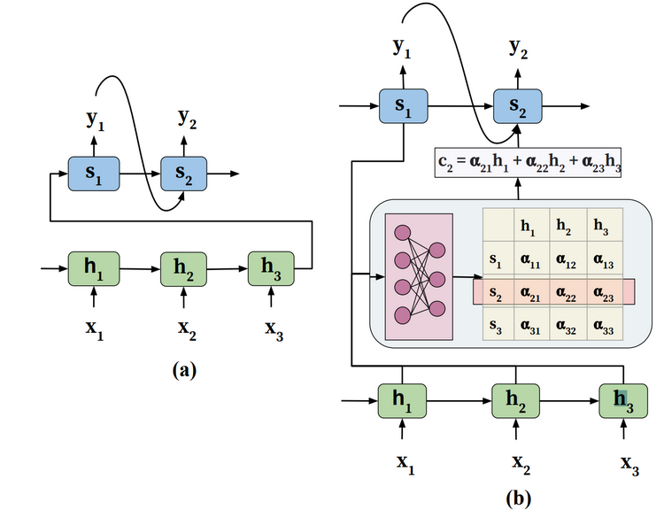
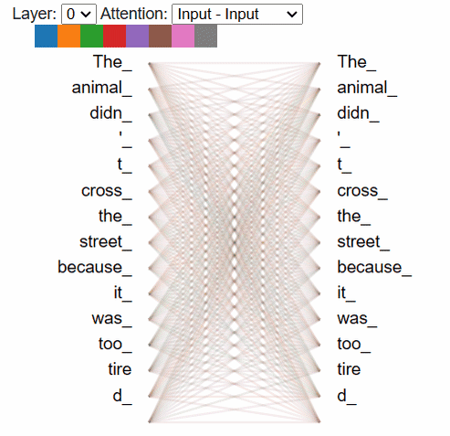

# Natural Language Processing

<subtitle><b>2023-2024 Blok D</b> 
HBO-ICT Artificial Intelligence Jaar 2
</subtitle>

<!--
The last comment block of each slide will be treated as slide notes. It will be visible and editable in Presenter Mode along with the slide. [Read more in the docs](https://sli.dev/guide/syntax.html#notes)
-->

---
transition: slide-left
layout: chaptertitle
---

# Inleveropdracht 5

## Recurrent Neural Networks

---
transition: slide-left
---

# Week 7

|Week|Les A|Les B|
|-|-|-|
|Week 1|Natuurlijke taal|Parsing|
|Week 2|NLTK Basics|Feature Extraction, Vector Space Models I|
|Week 3|Bayes’ Rule, Naïve Bayes|*hemelvaart*|
|Week 4|Vector Space Models II|Principle Component Analysis|
|Week 5|Locality Sensitive Hashing|Machine Translation|
|Week 6|Andere Modellen en Toepassingen|Deep Learning for NLP|
|Week 7|**Attention**|

---
layout: chaptertitle
---

# Les 12 – Attention
## GPT en Bert

---
layout: image-right
image: transformers.png
---

# Deep Learning for NLP

- Bidirectional Encoder Representations from Transformers (BERT)
- Generative Pre-trained Transformer (GPT)
- Transformers
- Attention

&nbsp;

&nbsp;

&nbsp;

&nbsp;

&nbsp;

&nbsp;

*Source: Vaswani et al. (2017)*

---
layout: image-left
image: bert.jpg
---

# BERT
- Bidirectional Encoder Representations from Transformers

- Transformer Encoder
- Input tokens matchen output tokens (of MASK)
- Left to right en right to left
- Generate all at once

---
layout: image-right
image: gpt.webp
---

# GPT
- Generative Pre-trained Transformer
- Autoregressive Transformer Decoder
- Token stream generator obv vorige token
- Geen encoder nodig
- Autonoom lezen corpora / unlabeled data

---

# Encoder / Decoder

- Self-attention Mechanism 
- Bewerk delen input sequence parallel
- Efficienter in capturen relaties
- Encode global context in representaties
- Gebruik downstream (predict / answer)

 

*Source: Chaudhari et al. (2021)*

---

# Attention

&nbsp;

&nbsp;

*Source: [GPT and BERT: A Comparison of Transformer Architectures](https://dev.to/meetkern/gpt-and-bert-a-comparison-of-transformer-architectures-2k46), Leonard Püttmann*

